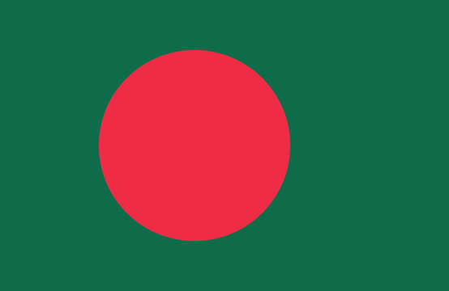
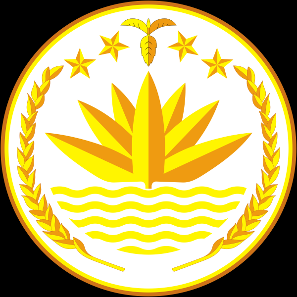
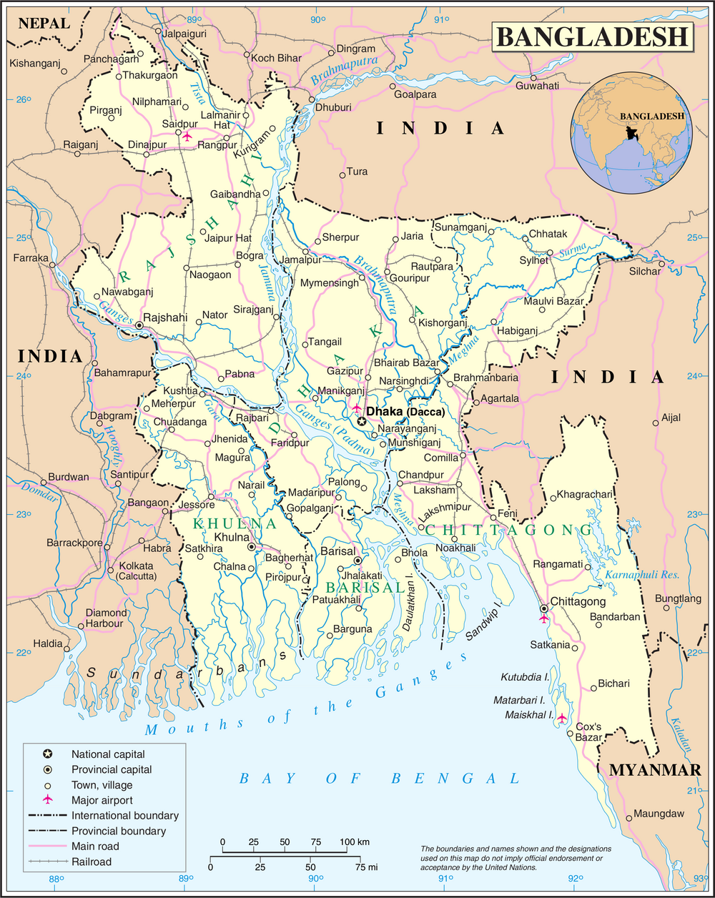
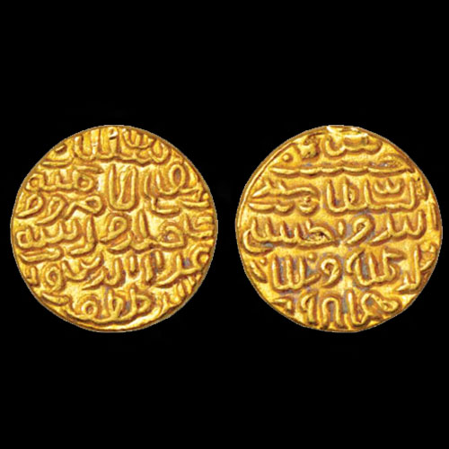
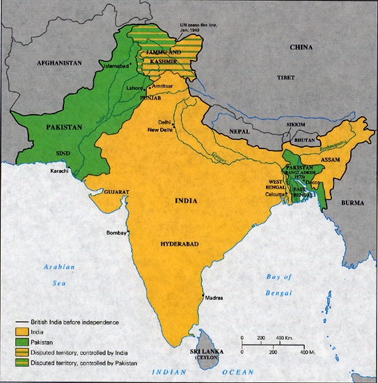
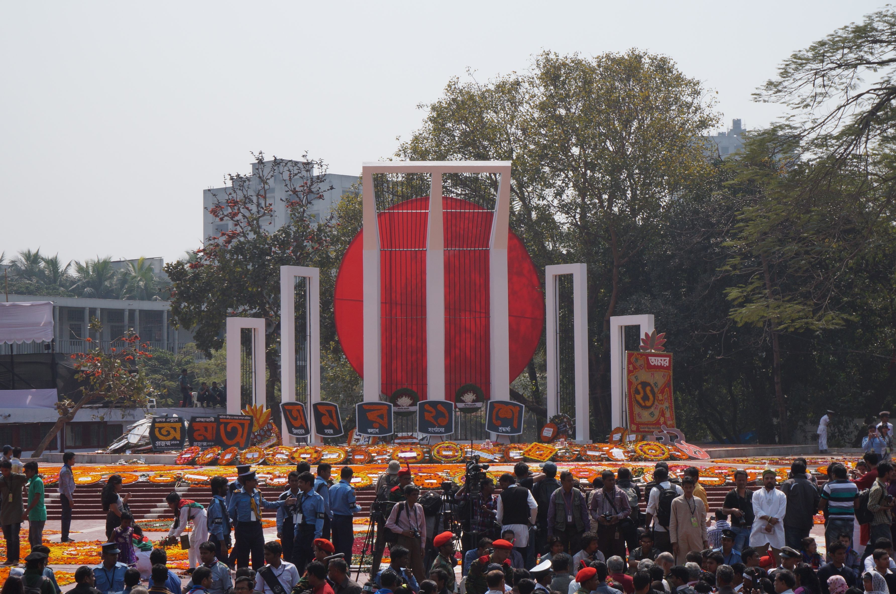

<html>

<h1 style="color: white;">Bangladesh</h1>

Bangladesh is a country in South Asia in the geographical Bengal region. Bangladesh borders India and Myanmar, and has a coast along the Bay of Bengal to the south. The densely populated country has a population of 169 million people according to the 2022 Census, making it the 8th most populous country in the world. 44 million of those people reside in the capital and largest city of Dhaka.

<html>
<head>

</head>
<body>

  

    
  

  

    
  

  

    
  

</body>
</html>

<h1 style="color: white;">History</h1>

<h2 style="color: white;">Early Period</h2>

In its early history, modern day Bangladesh saw a period of Hindu and Buddhist rule. The area was ruled over by various great Indian Hindu kingdoms like the Maurya and Gupta Empires, as well as the Buddhist Pala Empire. The Sena dynasty was the last empire to rule the Bengal region before the medieval period.

<h2 style="color: white;">Medieval Period</h2>

The Bengal region's medieval history was marked by Islamic rule. The Ghurid dynasty conquered the Sena dynasty in 1204, after which the region became part of the Delhi Sultanate of India. The region enjoyed a brief period of independence from 1341 to 1576 under the Bengal Sultanate. During this time period, the Sultanate greatly expanded its borders as well as its economy, inviting traders from China and Europe. Even after Mughal conquest in 1576, Bengal was a popular place of economic activity as international merchants sought the region's highly-prized textiles of cotton and silk. As the Mughal Empire began to decline in the early 18th century, Bengal acquired semi-autonomy and was controlled by rulers known as Nawabs.

<figure>

<figcaption style="color: lightgray;">Two gold coins from the Bengal Sultanate</figcaption>
</figure>

<h2 style="color: white;">British Period</h2>

Bengal was conquered by the British in 1757, becoming a part of the British Empire as the Bengal Presidency. The conquer of Bengal gave way for the British to conquer the rest of the Indian subcontinent. During its time as a province of British India, the Bengal region saw a decline in economic activity as the British took control of natural resources and raw materials, leading to the fall of the once-famous textile industry. British rule of the area was also marked by multiple famines, leading to the deaths of millions of people in the Bengal Presidency.

<h2 style="color: white;">East Pakistan</h2>

After Britain relinquished control over British India in 1947, the colony split into two countries: India and Pakistan. The borders of the countries were determined by the religious demographics of British India. Hindu-majority provinces were joined together to form India, while Muslim-majority provinces became Pakistan. Muslims in British India were concentrated in two parts of British India: in the Northwest and in the East. The Northwest areas became the province of West Pakistan, and the Eastern areas, which was the Bengal region, became the province of East Pakistan. Despite sharing religious beliefs and being unified as one country, the two provinces were located 1,000 miles apart and had significant cultural differences.

<figure>

<figcaption style="color: lightgray;">A map of the Indian Partition in 1947, with India in orange and Pakistan in green</figcaption>
</figure>

<h4 style="color: white;">Bengali Language Movement</h4>

One of the most prominent cultural differences between East and West Pakistan was language. West Pakistan was a multilingual province with multiple languages in various provinces. On the other hand, the entire population of East Pakistan spoke the Bengali language. Despite only a small percentage of the Pakistani population natively speaking the language, Urdu was declared as the national language of Pakistan besides English. In 1952, East Pakistan revolted, believing that they were being underrepresented as Bengali speakers despite being the majority of the overall Pakistani population. Despite Bengali being recognized as an official language four years after the revolt, the Pakistani government continued economic, political and ethnic discrimination against East Pakistan.

<figure>

<figcaption style="color: lightgray;">The Shaheed Minar, a monument in Dhaka to commemorate those who died in the Language Movement</figcaption>
</figure>

<h4 style="color: white;">Independence Movement</h4>

Increased government discrimination, alongside pre-existing cultural and social differences, continued the discord between East and West Pakistan. Increased support for a secular national ideology from the East and the Pakistani government's indifference to East Pakistan's welfare following a deadly 1970 cyclone only increased poltiical discontent. On March 7, 1971, the East Pakistani politician Sheikh Mujibur Rahman gave a speech calling on the Bengalis to join a "non-cooperation movement" of civil disobedience against the government. In response, the government carried out Operation Searchlight in East Pakistan on March 25, 1971 to crack down on the rising nationalist movement. The operation was marked by systematic killings of Bengali civilians, which further enraged East Pakistan and stirred up nationalist sentiment. A day after the operation started, Sheikh Mujibur Rahman declared the independence of East Pakistan as the nation of Bangladesh. This led to a bloody war of liberation that resulted in the genocide of many East Pakistani civilians; the estimated death toll ranges from 300,000 to 3 million killed. The war was fought between the Pakistan Armed Forces and the Mukti Bahini, a guerilla fighter group. Fighting and genocide continued until the surrendering of Pakistan on December 16, 1971 following Indian military intervention, and resulted in the liberation of the People's Republic of Bangladesh.

<h2 style="color: white;">Modern Era</h2>

Following independence, the new nation of Bangladesh saw political instability, with multiple assassinations of state leaders and a period of military dictatorship. Even after the restoration of parliamentary democracy in 1991, power struggles continued between the two major political parties, the Awami League and Bangladesh Nationalist Party. In 2024, student-led revolts led to the topple of long-time prime minister Sheikh Hasina, resulting in an interim government that continues as of 2025. Despite the political situation, Bangladesh has seen growth in other areas. The nation's economy continues to grow considerably and has made a name for itself in the textile industry. Bangladesh has also reduced poverty rates and is successfully decreasing its reliance on non-renewable energy sources, leading to a promising future for the country.

<h3 style="color: white;">Sources</h3>

<a href="https://en.wikipedia.org/wiki/Bangladesh">Bangladesh - Wikipedia</a>

<a href="https://en.wikipedia.org/wiki/Bangladesh_Liberation_War">Bangladesh Liberation War - Wikipedia</a>

<body style="background-color: black;">

</html>

